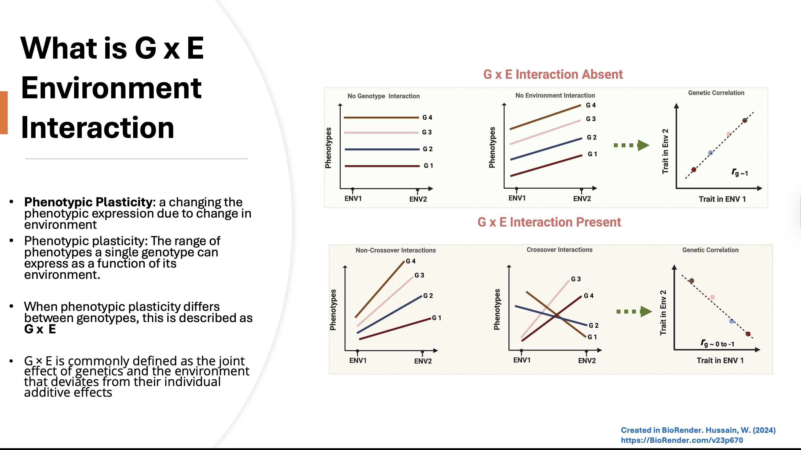

# Disecting Mixed Models of G x E: BLUEs and BLUPs

- This folder contains tutorials for dissecting G × E interactions using Henderson’s (1950) Mixed Model Equation (MME) framework.  
- Step-by-step instructions show how to manually extract BLUEs and BLUPs from models with interaction terms, without relying on any software or packages.  
- The aim is to reveal the core logic behind BLUEs and BLUPs by solving Henderson’s MME directly.

***No more tricks, no secrets, just good old matrix multiplication***

 
#  Source code and Document

- The source code in ****.R****  is available here [Mixed_Models/GxE_MME](https://github.com/whussain2/Mixed_Models/blob/main/GxE_MME/DisectingGxE.R)

- The Step-by-Step guide and PDF document file is available here [Disecting GxE](https://github.com/whussain2/Mixed_Models/blob/main/GxE_MME/DisectingGxE.pdf)

# How to Use the Source Codes and Run It locally

The steps to use the source codes and run it on local computer is given below:

- Open the GitHub page containing the source codes and files by using clicking the link [https://github.com/whussain2/Mixed_Models/tree/main](https://github.com/whussain2/Mixed_Models/tree/main).
- This will pop-up the Github repository, click on the **Code** button on right side of page highlighted as green box and scroll and click on **Download Zip**.
- Save and unzip the downloaded repository in local drive.
- Set **Mixed_Models_** as your working directory in R.
- Then open the folder GxE_MME 
- Open the ***.R*** file in R Studio and make sure to change the working directory based on users defined path to the repository.
- For opening PDF files, just open them in any any PDF package. 

# Contact
You may contact the author of this code, Waseem Hussain at <waseem.hussain@cgiar.org>; <waseemhussain907@gmail.com>
***

